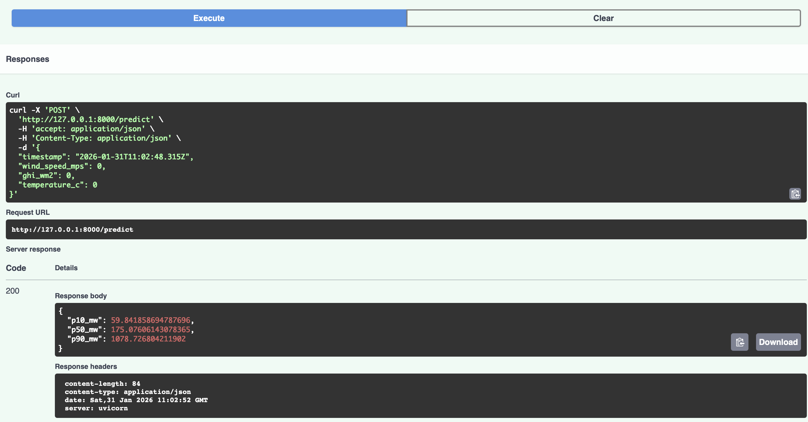

# Renewable Generation Forecast TR — Rüzgâr/Güneş Üretimi + Belirsizlik (P10/P50/P90) + FastAPI + CI

### Swagger UI



> **Amaç:** Yenilenebilir enerji üretimi (rüzgâr + güneş) için saatlik tahmin üreten ve belirsizliği yönetmek amacıyla **P10 / P50 / P90** senaryolarını döndüren, API üzerinden kullanılabilir ve CI ile doğrulanmış uçtan uca bir demo sistem geliştirmek.

---

## Neden bu proje?
Yenilenebilir üretim (özellikle rüzgâr ve güneş) **hava koşullarına bağlı** olduğu için doğal olarak **değişken ve belirsizdir**. Gerçek operasyonlarda çoğu zaman tek bir sayı (nokta tahmin) yeterli olmaz.

Bu yüzden bu projede tahmin çıktısını üç senaryo olarak sunuyoruz:

- **P10 (kötümser/düşük senaryo):** Üretimin düşük gelme ihtimalini temsil eder  
- **P50 (en olası):** En gerçekçi/orta senaryo  
- **P90 (iyimser/yüksek senaryo):** Üretimin yüksek gelme ihtimalini temsil eder  

Bu yaklaşım; planlama, risk yönetimi ve karar alma süreçleri için daha anlamlı bir temel sağlar.

---

## Sistem Bileşenleri
### 1) Veri üretimi (sentetik/demo)
`make_dataset.py`, saatlik bir veri seti üretir:
- `wind_speed_mps` → rüzgâr hızı (m/s)
- `ghi_wm2` → güneş ışınımı benzeri gösterge (W/m²)
- `temperature_c` → sıcaklık (°C)
- `generation_mw` → hedef değişken (rüzgâr+güneş toplam üretim MW)

Çıktı:
- `data/processed/renewables.csv`

### 2) Modelleme: P10 / P50 / P90
`train.py`, üç ayrı model eğitir ve joblib ile kaydeder:
- `models/q10.joblib` → P10
- `models/q50.joblib` → P50
- `models/q90.joblib` → P90

> Not: API çalışırken bu dosyalar yoksa `/predict` 503 döner. Bu yüzden önce dataset ve training çalıştırılmalıdır.

### 3) API ile servisleştirme (FastAPI)
- `POST /predict` → `{p10_mw, p50_mw, p90_mw}`
- `GET /health` → servis ayakta mı?

Swagger (etkileşimli dokümantasyon):
- `GET /docs`

### 4) Test + CI (GitHub Actions)
- Lokal: `pytest` ile API ve uçtan uca kontroller  
- CI: Her push/PR’da otomatik test

---

## Hızlı Başlangıç (Local Run)

> Proje `src/` layout kullandığı için komutlarda `PYTHONPATH=src` kullanıyoruz.

### 1) Kurulum
```bash
python3 -m venv .venv
source .venv/bin/activate
pip install --upgrade pip
pip install -r requirements.txt
